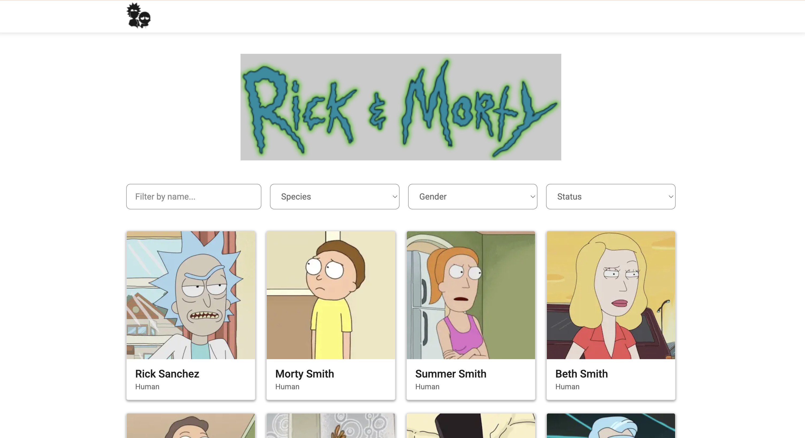
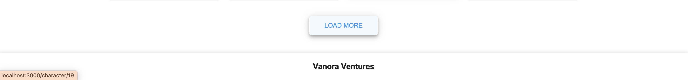
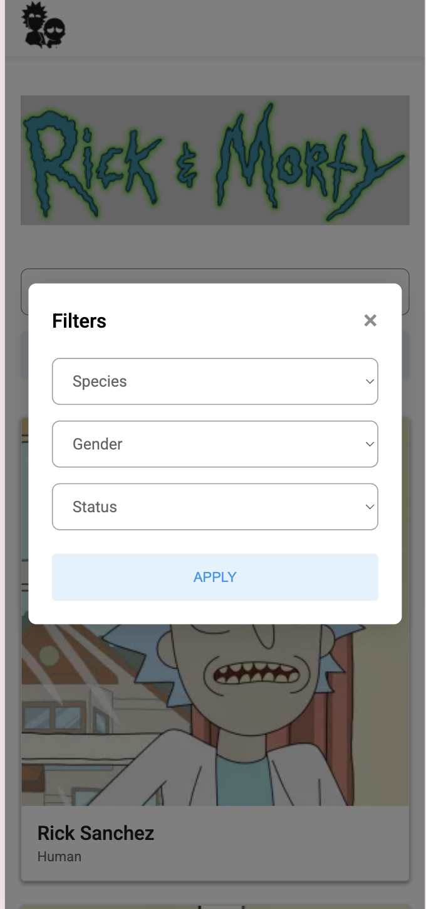
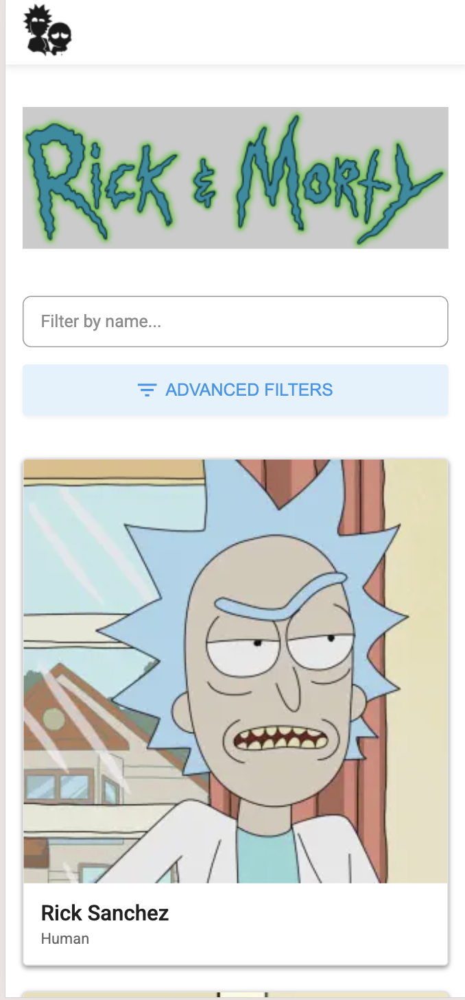
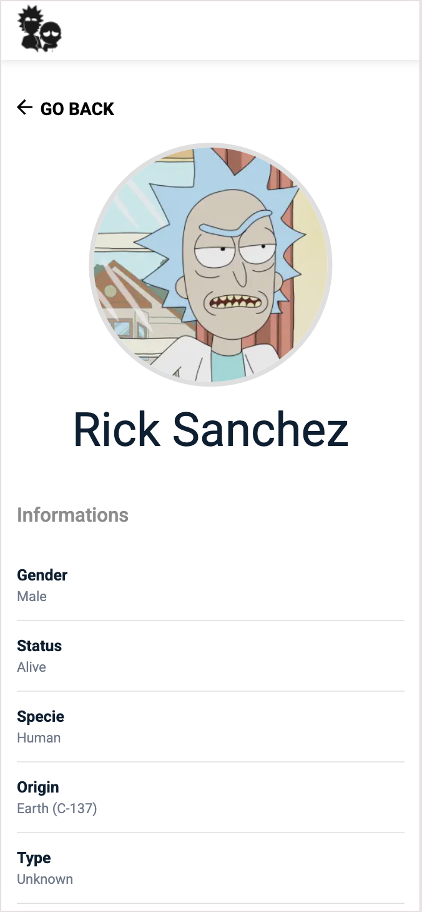

# Vanora Case – Rick and Morty Characters

A character listing application built with **Next.js** that consumes the **Rick and Morty API**.
Users can browse characters, filter them by different attributes and view detailed information.

---

## 🚀 Tech Stack

* **Next.js (App Router)**
* **React**
* **TypeScript**
* **CSS Modules**
* **Rick and Morty API**

---

## ✨ Features

* Character listing
* Character detail page
* Filtering by:

  * Name
  * Species
  * Gender
  * Status
* Pagination / Load More
* Responsive layout

---

## 📂 Project Structure

```
src
│
├── app
│   ├── page.tsx
│   └── character
│       └── [id]
│           └── page.tsx
│
├── models
│   └── character.ts
│
├── services
│   └── characterService.ts
│
├── hooks
│   └── useDebounce.ts
│
└── views
    ├── components
    │   ├── container
    │   ├── header
    │   ├── footer
    │   ├── characterCard
    │   ├── filters
    │   ├── backButton
    │   └── heroLogo
    │
    └── sections
        └── list
```

---

## ⚙️ Getting Started

Clone the repository

```
git clone https://github.com/kadirkar22/rick-and-morty-nextjs-case.git
```

Install dependencies

```
npm install
```

Run the development server

```
npm run dev
```

Open in browser

```
http://localhost:3000
```

---

## 🌐 API

This project uses the public API:

https://rickandmortyapi.com

Example endpoint:

```
https://rickandmortyapi.com/api/character
```

---

## 📸 Screenshots

### Character List (Desktop)





### Character Detail (Desktop)


### Character List, Detail, Filter (Mobile)

<div style="display: flex; justify-content: space-between; flex-wrap: wrap; gap: 10px;">
  
  
  
</div>

---


